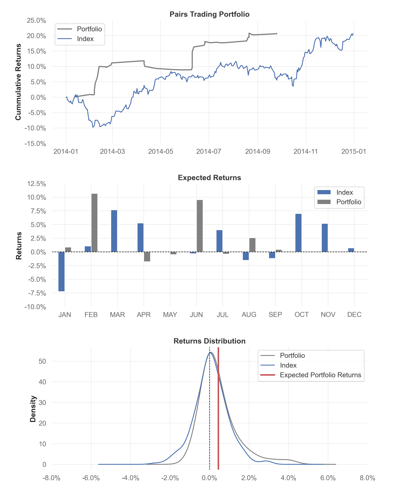

# **Cointegration Pairs Trading Strategy in South African Consumer Cyclical Stocks**
[Thabang Ndhlovu,](http://www.linkedin.com/in/thabangndhlovu) October 2022

This notebook provides a comprehensive example of using machine learning techniques to apply cointegration in a pairs trading strategy for identifying mean-reverting spreads in South African Consumer Cyclical Stocks. Pairs trading is a market-neutral strategy that involves taking a long position in one security and a short position in another, in a predetermined ratio. The securities chosen for the pair should have some economic link.

The underlying assumption of pairs trading is that stocks with similar characteristics and an economic link should be priced similarly. With this in mind, our stock universe includes a selection of South African consumer cyclical stocks listed on the Johannesburg Stock Exchange [(JSE)](http://jse.co.za).

### Portfolio Analysis

Although the portfolio outperformed the index slightly, it performed relatively well. 

It is important to consider the limitations of the results presented. One important factor to keep in mind is the use of closing prices, which are widely available but may not accurately reflect the prices at which one could realistically trade. This is because closing prices are often the result of an auction and can introduce additional volatility to the data. As a result, the results of pairs trading strategies run on closing price data may be better than they would be in real-world trading. It is worth bearing in mind that this may lead to an overestimation of the potential profitability of the strategy.

### About Me
Email: ndhlovuthabang1@gmail.com

LinkedIn: http://www.linkedin.com/in/thabangndhlovu

### Disclaimer
This notebook is entirely for educational purposes. None of the information in this notebook constitutes a recommendation that any particular portfolio of securities is suitable for any particular person. All trading strategies are used at your own risk.
